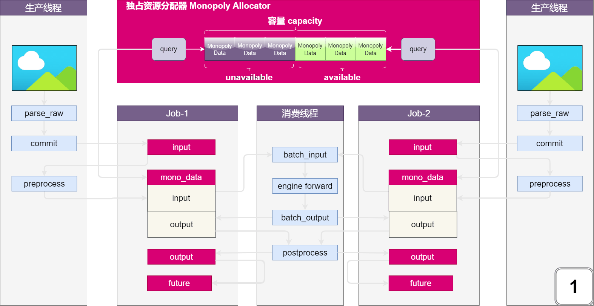
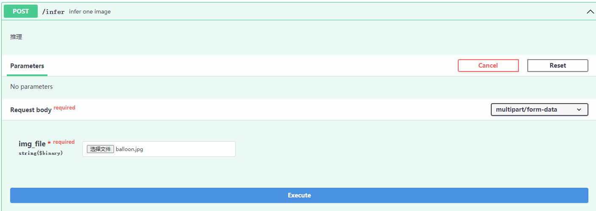

# 概述

机器学习高性能推理解决方案（python 版）;

**功能**

1. 基于事件循环的非阻塞同步动态 Batch 推理：推理的并发和并行；
2. 独占资源分配器：预处理和推理并行，并且防止内存溢出；
3. 分解推理：分解为多个子任务推理；

**基本流程**


1. 异步服务：FastAPI 注册的路由 `route func`，`route func`为异步协程，实现并发访问；
2. 异步推理：`route func`解析请求参数获取输入，将输入封装成 job，并立即返回未完成计算 `future`；`route func`通过 await 挂起，直到协程 `future`返回结果；
3. 执行任务：创建消费者线程，从任务队列 `queue`中获取任务并执行具体的推理工作，并将推理结果填充至 `future`；
4. 结果返回：异步协程 `future`在结果填充后返回，程序回到 `route func`，收集推理结果通过 FastAPI 返回，完成一次推理；

**数据流**



1. 接收数据：FastAPI 路由函数 `route func`接收数据流 `raw_data`；
2. 解析数据：生产者线程通过推理器 `infer.parse_raw`方法，将 `raw_data`解析为推理器输入格式 `infer.Input`；
3. 存储推理任务输入：将解析后输入 `input`存储在 `job.input`；
4. 预处理：通过 `preprocess`对 `job.input`做预处理；
5. 存储模型输入：申请数据资源 `mono_data`，将预处理后模型输入存储至 `mono_data.input`；
6. 多个任务模型输入组成 batch：多个任务 `mono_data.input`组合为 `batch_input`;
7. 存储模型输出：根据索引，从 `batch_output`中获取任务输出记录在 `mono_data.output`中；
8. 后处理：通过 `postprocess`，将模型输出 `mono_data.output`转换为最终推理结果存储在 `job.output`中；
9. 返回推理结果：将推理结果 `job.output`填充至未完成工作 `future`，使 `future`变成完成状态，FastAPI 获取 `future.result()`后返回；

# 安装

```
pip install fastapi[all]
```

# 关键技术

## 异步动态 Batch 推理

1. 异步

python 的异步模块并非真实的异步，而是基于事件循环的非阻塞同步操作；

- 阻塞和非阻塞：调用方等待计算完成；
- 同步和异步：同步，调用方轮询计算是否完成；异步，约定某一通信方式，当任务完成时通知调用方。

生产者提交推理任务，返回未完成计算 `future`，调用方不必等待推理任务完成，可继续接收 http 请求，生产新的推理任务，因此是非阻塞的。生产者轮询推理任务是否完成，完成则通过 http 返回推理结果，因此，是同步的。`python asyncio`源码如下：

```python
from asyncio.futures import Future


async def func():
    future = Future() # 非阻塞
    await future # 同步


class Future():
        def __init__(self, *, loop=None):
            if loop is None:
                # 事件循环，事件指future.set_result事件, 事件发生时执行绑定事件的callback回调函数
                self._loop = events.get_event_loop()

        def set_result(self, result):
            # set_result事件修改任务状态，之后出发set_result事件绑定回调，事件循环loop与future的非阻塞同步无关；
            self._state = _FINISHED
            self.__schedule_callbacks()

        def __await__(self):
            if not self.done(): # 判断是否完成计算
                self._asyncio_future_blocking = True
                yield self  #出让CPU时间片
            if not self.done():
                raise RuntimeError("await wasn't used with future")
            return self.result()  # 返回推理结果

        __iter__ = __await__  # 循环迭代，轮询方式；

```

python 中提供两种未完成计算 `future`，`concurrent.futures`和 `asyncio.futures`，前者基于线程通信实现非阻塞异步，后者基于事件循环+协程实现非阻塞同步。

2. 动态 Batch 推理

通过 Batch 实现并行：基于生产消费设计模式、任务队列、线程通信等机制，推理时可将多个任务合并为一个 Batch 推理，提供推理并行度。

## 独占资源分配器

独占资源分配器实现两个功能：预处理和推理并行和内存防溢出。

由 job 结构和数据流动可知，要想将 job 加入任务队列必须经过预处理 preprocess，而预处理必须申请独占数据资源（python 类对象），才能够存储预处理输出（模型输入）和后处理输入（模型输出），因此，设计独占资源分配器，可以巧妙控制整个推理的进行；

1. 内存防溢出：独占资源分配器设定指定数量的独占资源，当所有资源被分配占用时，再次 commit 必须等待之前的任务推理完成，释放资源；因此内存占用恒定，大量 commit 不会造成服务器内存溢出崩溃；
2. 预处理和推理解耦：独占数据资源数量一般为最大 batch_size 两倍，此时，满足一个 batch_size 进行预处理，一个 batch_size 进行推理，即预备一个 batch_size，实现 prefetch 的功能，从而使预处理和推理同时进行，提高推理效率；

## 分解推理

分解推理：将推理任务拆分为若干子任务，合并子任务推理结果，最终得到完整的推理结果；分解推理是通过 `jobset`任务集类型实现的。

**场景一: 遥感图像目标检测**
将遥感大图 A 拆分为瓦片图 `A1、A2、...、An`，对应创建子任务 `job1、job2、...、jobn`，融合每个瓦片图检测结果，获取大图检测结果；

# 测试

测试mmdetection训练模型：

1. 安装mmdetection和mmcv
2. 下载balloon目标检测推理配置文件、模型文件，存放至`applications`目录下；[下载地址](https://pan.baidu.com/s/1Y9KZVFuUB21vfXinZ60xDg )，提取码：ctiv；

```
├─applications
│  └─balloon
│      ├─configs
│      │      balloon.py
│      │
│      └─models
│              model.pth
│              yolox_s_8x8_300e_coco.py
```

2. 启动服务

切换路径至根目录下：

```bash
python app.py ./applications/balloon/configs/balloon.py
```

3. 测试接口

上传 workspace 目录下 balloon.jpg；


